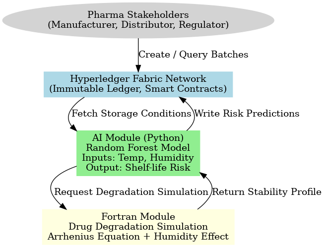

# **Blockchain-Backed Pharma Drug Stability & Supply Chain Tracker**

This project integrates **Hyperledger Fabric**, **AI (Python)**, and **Fortran** to build a secure, intelligent drug tracking and stability prediction system.

---

## **📌 System Architecture**




---

## **🔹 Components**

### 1. Hyperledger Fabric Network
- Provides a tamper-proof ledger for drug batches, transport events, and regulatory audits.
- Chaincode (`pharma-cc`) enforces rules:
  - Only manufacturers can create batches.
  - Transport conditions (temperature, humidity) are stored securely.
  - Regulators can audit and approve/reject shipments.
- Transactions ensure traceability and compliance.

### 2. AI Module (Python, scikit-learn)
- Uses **Random Forest Classifier** to predict spoilage risk based on **temperature** and **humidity**.
- Input features: `temp`, `humidity`.
- Output: `shelf_life_ok` → **1 (safe)** or **0 (high risk)**.
- Trained with `drug_conditions.csv` dataset.
- Exposed as a REST API with **FastAPI** for integration.

### 3. Fortran Simulation Module
- Implements **drug degradation modeling** using the **Arrhenius equation**.
- Takes temperature & humidity profiles over time.
- Returns degradation curve (drug concentration vs. time).
- Exposed to Python via **f2py** and wrapped with FastAPI.

### **📖 Scientific Background**

**Arrhenius Equation**: Models drug degradation rate constant k = A * exp(-Ea / (R * T)).

**Random Forest AI Model**: Predicts spoilage risk from environmental factors.

---

# **Setup Instructions**

### Hyperledger Fabric Setup
```bash
./start-network.sh 
```

### AI Module

For training

```bash
python train_model.py
```

Run as a service

```bash
uvicorn predict_model:app --reload --host 0.0.0.0 --port 8000
```

### Fortran Module

Compile Fortran code to Python

```bash
f2py -c -m drug_degradation_py drug_degradation.f90
```

Run as a service

```bash
uvicorn drug_simulation:app --reload --host 0.0.0.0 --port 7000
```

### Frontend
```bash
npm install
npm start
```

### Fabric SDK (Java) - Run as a Service

Available APIs:

- Submit transactions
- Submit transport events
- Add AI predictions
- Add Fortran simulation results
- Audit batches
- Query transactions & block height

📡 **Example Requests**

**Create a Drug Batch**

```bash
POST http://localhost:9000/pharma-app/v1.0/HLF/submitTransactions
{
  "chaincodeName": "pharma-cc",
  "methodName": "CreateBatch",
  "channelName": "pharmachannel",
  "isTransient": "false",
  "inputParameters": ["BATCH000000001000","DrugX","2025-09-09","2027-09-09"]
}
```

**Record Transport Data**

```bash
POST http://localhost:9000/pharma-app/v1.0/HLF/submitTransportTransactions
{
  "chaincodeName": "pharma-cc",
  "methodName": "RecordTransport",
  "channelName": "pharmachannel",
  "isTransient": "true",
  "transientKey": "transport",
  "transientValue": "{\"temperature\":4,\"humidity\":60,\"timestamp\":\"2025-09-09T10:05:00Z\"}",
  "inputParameters": ["BATCH000000001000"]
}
```

**Add Fortran Simulation Result**

```bash
POST http://localhost:9000/pharma-app/v1.0/HLF/submitTransactions
{
  "chaincodeName": "pharma-cc",
  "methodName": "AddSimulationResult",
  "channelName": "pharmachannel",
  "isTransient": "true",
  "transientKey": "simulation",
  "transientValue": "{\"modelVersion\":\"v1.0\",\"curve\":[[25,100],[40,80]],\"notes\":\"accelerated stability\"}",
  "inputParameters": ["BATCH000000001000"]
}
```

**Add AI Prediction Result**

```bash
POST http://localhost:9000/pharma-app/v1.0/HLF/submitTransactions
{
  "chaincodeName": "pharma-cc",
  "methodName": "AddPredictionResult",
  "channelName": "pharmachannel",
  "isTransient": "true",
  "transientKey": "prediction",
  "transientValue": "{\"spoiled\":true,\"risk\":\"Yes\"}",
  "inputParameters": ["BATCH000000001000"]
}
```

**Audit Batch**

```bash
POST http://localhost:9000/pharma-app/v1.0/HLF/submitTransactions
{
  "chaincodeName": "pharma-cc",
  "methodName": "AuditBatch",
  "channelName": "pharmachannel",
  "isTransient": "true",
  "transientKey": "audit",
  "transientValue": "{\"status\":\"APPROVED\",\"remarks\":\"All good\",\"timestamp\":\"2025-09-09T10:15:00Z\"}",
  "inputParameters": ["BATCH000000001000"]
}
```

**Query Batch Details**

```bash
http://localhost:9000/pharma-app/v1.0/HLF/getTransactions?channelName=pharmachannel&chaincodeName=pharma-cc&methodName=GetBatchDetails&value=BATCH000000001000
```

**Check Block Height**

```bash
http://localhost:9000/pharma-app/v1.0/HLF/getBlockHeight?channelName=pharmachannel
```

🔍 **Testing AI & Fortran Services**

**AI Prediction**

```bash
curl -X POST "http://127.0.0.1:8000/predict" \
-H "Content-Type: application/json" \
-d '{"temp": 30, "humidity": 70}'
```

**Fortran Simulation**

```bash
curl -X POST http://127.0.0.1:7000/simulate \
-H "Content-Type: application/json" \
-d '{
    "C0": 100.0,
    "A": 1.0e12,
    "Ea": 85000.0,
    "time_start": 0.0,
    "time_end": 70.0,
    "time_points": 8,
    "temperature_profile": [25,30,28,35,33,40,38,36],
    "humidity_profile": [60,65,70,75,70,65,60,55]
}'
```
